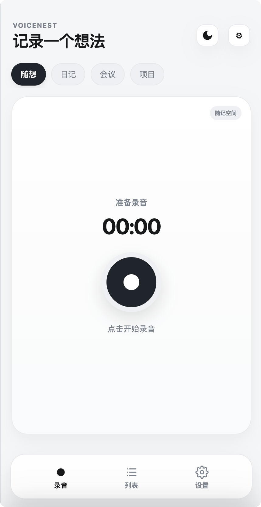
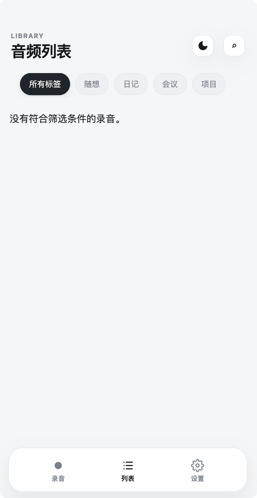
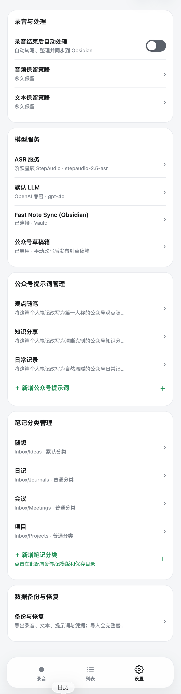

# VoiceNest PocketBase

VoiceNest PocketBase 是 VoiceNest 的**自托管、本地优先（Local-First）**版本。它可以将一闪而过的语音想法经 ASR 与 LLM 转录润色，并同步至 Obsidian 或微信公众号草稿箱。

它不依赖 Cloudflare、Vercel、Pages、Worker 或 KV：单个 PocketBase Docker 容器负责账号鉴权与微信公众号凭据加密代理；录音、文本与模型配置仍只保存在用户当前设备。

## 界面预览

<p align="center">
  
  
  
</p>

---

## ✨ 核心特性

1. **🔒 数据 100% 本地优先 (Local-First)**：
   * **音频与模型密钥仅在本机**：录音音频分片、ASR Key、LLM Key 与本地笔记均保存在当前设备。若启用 Obsidian 同步，整理后的标题、正文和目标目录会经 HTTPS 临时写入 PocketBase 队列；插件确认写入 Vault 后，服务器立即删除正文，仅保留短期无正文同步回执。
   * **配置完全离线**：您的 ASR 密钥、LLM 端点、NoteTypes（分类）等设置也完全离线保存在本地 localStorage，保护大模型 API Key 绝不脱离您的受控设备，从物理上杜绝脱库风险。ASR 请求默认最多等待 15 分钟，适合较长录音的转写。
2. **🛡️ 微信凭证 SaaS 级加密与代理代发**：
   * 微信公众号要求请求源为固定公网 IP（白名单）。本系统通过 VPS 上的 PocketBase 后端作为代理网关发起微信请求。
   * **AES-256-GCM 强加密**：用户的公众号 `AppSecret` 由前端单向提交，在后端使用 32 字节主密钥加密后存储于 SQLite 中。
   * **字段防泄漏**：利用 PocketBase 引擎底层的 `"hidden": true` 过滤机制，`encryptedSecret` 密文字段在任何 API 响应中都会被强制抹除，前端客户端和外界绝无可能再次拉取到密钥。
---

## 🛠️ 项目运行与编译

### 1. 本地开发调试
```bash
npm install
npm run dev   # 启动前端开发服务器 (http://localhost:5173)
npm run test  # 运行单元测试
npm run build # 编译前端静态 PWA 资源 (生成 dist 目录)
```

### 2. Android 壳同步与编译 (Capacitor)
当前 Android APK 容器基于 Capacitor 实现。若前端发生改动，请在工作区下运行以下命令同步：
```bash
npm run build
npx cap sync android  # 将最新前端静态文件拷入 Android 壳工程中
```
**编译生成 APK 安装包：**
* **方式一**：使用 **Android Studio** 打开 `android/` 目录，等待同步完成后点击菜单栏 **`Build`** -> **`Build Bundle(s) / APK(s)`** -> **`Build APK(s)`**，生成后点击右下角 locate 即可。
* **方式二**：若您本机有 JDK 运行环境，直接在终端中切到 `android/` 目录运行：
  ```bash
  cd android
  ./gradlew assembleDebug
  ```
  生成的 APK 路径为：`android/app/build/outputs/apk/debug/app-debug.apk`。

**正式签名 APK：** release 构建必须提供同一套 keystore，缺任一变量会失败，避免误发布 debug 包。
```bash
set -a && source /Users/luluen/.voicenest-release/credentials.env && set +a
cd android && ./gradlew assembleRelease
```
发布到 GitHub Release 时，资产必须命名为 `VoiceNest-v<versionName>-<versionCode>-release.apk`，tag 为 `v<versionName>`；应用会校验 GitHub SHA-256、包名、版本号和签名后才请求 Android 安装。

---

## 🚀 Docker 生产部署

生产环境推荐使用 Docker 进行一键式容器部署。PocketBase 会在启动时自动运行 `pb_migrations` 迁移以及 `pb_hooks`。

### 1. 部署前准备
1. 准备一台可公网访问且有固定 IP 的服务器（用于填写进微信公众号后台的 IP 白名单中），已安装 Docker 与 Docker Compose。
2. 生成一个 32 字节随机加密主密钥（用于后端 AES 加密）：
   ```bash
   openssl rand -base64 24 | head -c 32
   ```
3. 从示例创建环境变量文件，再填入该密钥，以及仅用于**首次初始化** PocketBase 超级管理员的邮箱和高强度密码：
   ```bash
   cp .env.example .env
   ```
   ```env
   VN_ENCRYPTION_KEY=您的32字节随机密钥字符串
   PB_SUPERUSER_EMAIL=admin@example.com
   PB_SUPERUSER_PASSWORD=请设置至少10位的随机高强度密码
   ```
   ⚠️ **注意**：`.env` 已被 Git 忽略。**切勿**将其公开提交或写入任何前端代码中。若加密密钥长度不为 32，容器启动时会报错拒绝服务。首次启动成功后可从 `.env` 删除 `PB_SUPERUSER_EMAIL`、`PB_SUPERUSER_PASSWORD`；请妥善保存管理员密码。

### 2. 一键启动
```bash
# 本机构建并推送 linux/amd64 镜像（VPS 直接拉取，不在服务器构建）
export VOICENEST_IMAGE=lulalulaluobo/voicenest:your-release-tag
docker build --platform linux/amd64 -t "$VOICENEST_IMAGE" .
docker push "$VOICENEST_IMAGE"

# VPS：在 .env 写入相同的 VOICENEST_IMAGE，再拉取并启动；首次创建 ./pb_data 时会校验超级管理员变量
docker compose pull
docker compose up -d
```
* Compose 默认只监听本机 `127.0.0.1:8090`，请通过反向代理对外提供 HTTPS。
* **前端 PWA 地址**：`https://<您的域名>`
* **PocketBase 管理后台**：`https://<您的域名>/_/`

*公网部署必须在 PocketBase 前面配置 Caddy / Nginx 等反向代理及 TLS 证书；手机 PWA 的麦克风权限也需要 HTTPS。已有数据库如曾使用旧版固定 `admin@example.com` / `admin123456` 账号，请立即在管理后台删除或改密该账号。*

> 若 HTTPS 反向代理位于另一台 VPS，设置 `PB_BIND_ADDRESS=0.0.0.0`，并在 PocketBase 所在服务器的 Docker 防火墙中仅允许该代理 VPS 访问 TCP 8090；不可直接向所有公网来源开放。

---

## ⚙️ 使用与配对流程

1. **下载安装 APK**：手机安装编译好的 APK。首次启动时可点击“使用免费公共后端”连接 `https://voicenest.lucc.fun`，或填写您自建的 PocketBase HTTPS 地址（例如 `https://pb.yourdomain.com`）。
2. **注册与登录**：点击“注册”账号并自动登录，您的账号将独占独立的云端微信加密数据行。
3. **配置 Obsidian 本地插件（可选）**：运行 `cd obsidian-plugin && npm install && npm run build`，将 `main.js` 和 `manifest.json` 放入 Vault 的 `.obsidian/plugins/voicenest-sync/` 后启用。在 VoiceNest 设置页生成可撤销的同步 Token，粘贴到插件；插件通过 `changes → 写入 Vault → ack → cursor` 单向拉取，文件名使用笔记标题，`voicenest_id` 保留在 YAML 元数据中，成功确认后才推进游标。
4. **安全配置微信**：
   * 进入“设置” -> “公众号草稿箱”，输入您的公众号 `AppID` 与 `AppSecret` 点击**保存**（自动单向加密上传）。
   * 将您 VPS 的公网固定 IP 填入微信公众号后台的“IP白名单”中，随后在设置页中点击“测试公众号连接”验证。
   * 选择并上传一张图片作为您公众号默认的封面图（同步写入微信永久素材库）。
5. **开始体验**：回到主页，点击大圆按钮开始录音；录制中再次点击即可暂停，再次点击继续。下方“结束”保存本次录音，“取消”会二次确认并彻底丢弃本次录音。随后可整理、改写并预览排版，最后发布到微信公众号草稿箱。
